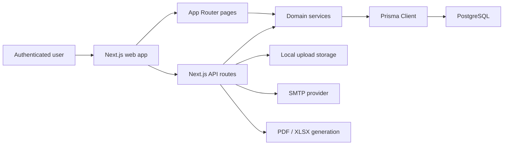
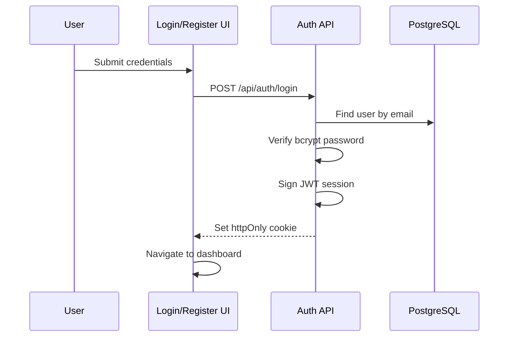
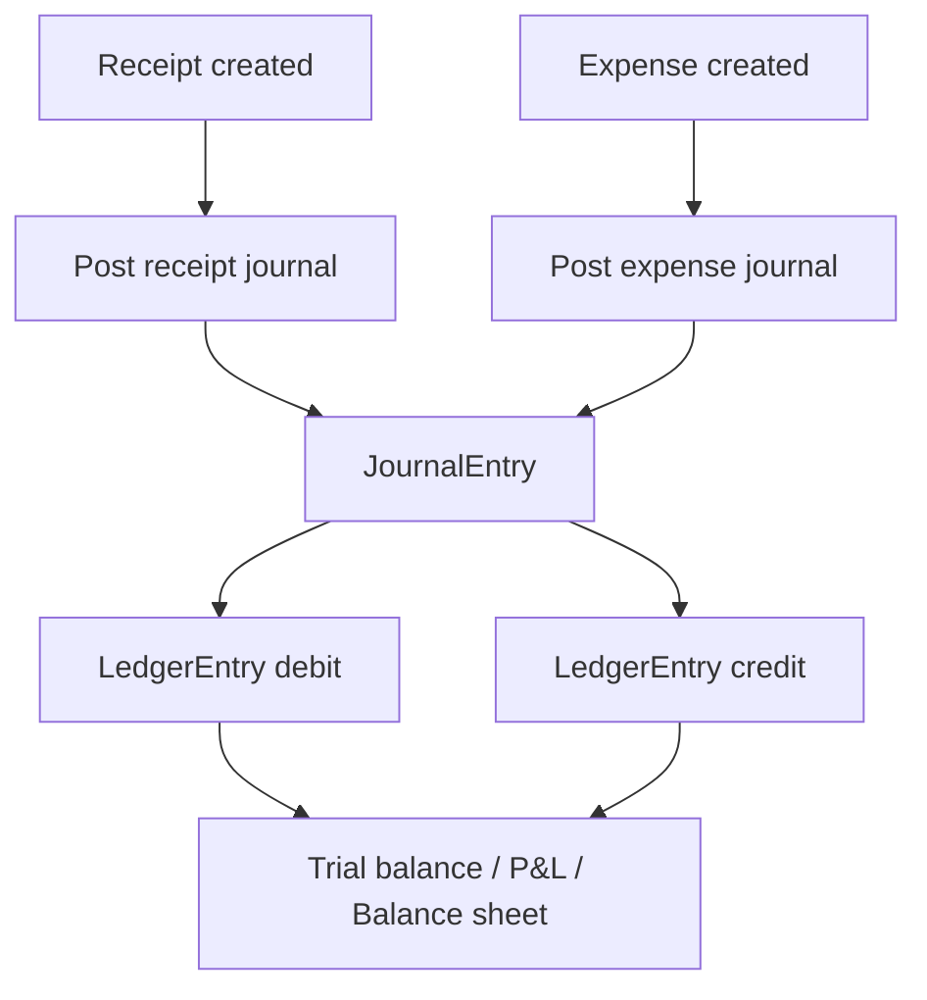
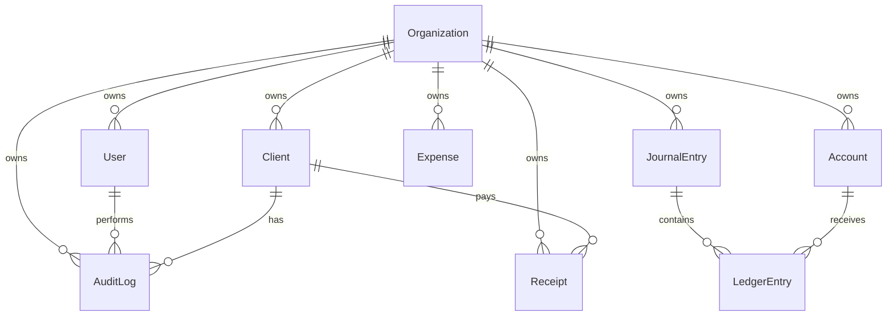

# Architecture Document

## 1. Purpose

Ledgerly is a multi-currency accounting and expense tracking SaaS for freelancers, consultants, agencies, and small businesses. The application provides authenticated financial workflows for client management, incoming receipts, expenses, ledger accounting, dashboard analytics, report generation, exports, uploads, and audit tracking.

This document describes the current repository architecture and the intended production evolution path.

## 2. Technology Stack

| Layer | Technology |
| --- | --- |
| Web framework | Next.js App Router |
| UI runtime | React, TypeScript |
| Styling | Tailwind CSS |
| Charts | Recharts |
| Forms and validation | React Hook Form-ready components, Zod schemas |
| API layer | Next.js route handlers |
| Database ORM | Prisma |
| Database | PostgreSQL |
| Authentication | JWT signed session cookie |
| Authorization | Role-based access control |
| Exports | jsPDF, xlsx |
| Email | Nodemailer |
| Runtime packaging | Dockerfile, Docker Compose PostgreSQL |

## 3. High-Level System Context



The application is currently a single deployable Next.js service. It uses server-rendered pages for primary workflows and API route handlers for mutations, exports, uploads, and JSON data access.

## 4. Repository Structure

```text
app/                  Next.js pages, layouts, and API route handlers
components/           Shared UI and layout components
modules/              Feature modules with forms, charts, and validation
services/             Business and domain services
lib/                  Infrastructure helpers: auth, Prisma, env, API wrappers
prisma/               Prisma schema and seed data
docs/                 API, architecture, and design documentation
types/                Shared TypeScript types
utils/                General utilities
public/uploads/       Local validated upload destination
```

## 5. Application Layers

### Presentation Layer

The presentation layer lives in `app`, `components`, and UI-focused files under `modules`.

Responsibilities:

- Render authenticated dashboard pages.
- Present forms for auth, clients, receipts, expenses, and reports.
- Render charts, metric cards, data tables, and report summaries.
- Keep user-facing screens responsive and consistent.

Key files:

- `app/(dashboard)/layout.tsx`
- `app/(dashboard)/dashboard/page.tsx`
- `app/(dashboard)/clients/page.tsx`
- `app/(dashboard)/transactions/page.tsx`
- `app/(dashboard)/reports/page.tsx`
- `components/layout/sidebar.tsx`
- `components/layout/topbar.tsx`

### API Layer

The API layer is implemented with Next.js route handlers under `app/api`.

Responsibilities:

- Authenticate requests.
- Enforce RBAC.
- Validate request bodies with Zod.
- Apply pagination and filtering.
- Call domain services.
- Return JSON or binary export responses.

Key route groups:

- `app/api/auth/*`
- `app/api/clients/*`
- `app/api/receipts/route.ts`
- `app/api/expenses/route.ts`
- `app/api/dashboard/route.ts`
- `app/api/ledger/trial-balance/route.ts`
- `app/api/reports/[type]/*`
- `app/api/uploads/route.ts`

### Domain Service Layer

The domain service layer lives in `services`.

Responsibilities:

- Maintain accounting invariants.
- Generate dashboard analytics.
- Generate financial reports from ledger data.
- Export reports to PDF/XLSX.
- Send reports by email.
- Write audit logs.

Key files:

- `services/accounting-service.ts`
- `services/dashboard-service.ts`
- `services/report-service.ts`
- `services/export-service.ts`
- `services/email-service.ts`
- `services/audit-service.ts`

### Infrastructure Layer

The infrastructure layer lives primarily in `lib`.

Responsibilities:

- Database access through Prisma.
- Environment validation.
- JWT session creation and verification.
- Password hashing.
- Shared API error handling and rate limiting.

Key files:

- `lib/prisma.ts`
- `lib/env.ts`
- `lib/auth.ts`
- `lib/api.ts`

## 6. Authentication and Authorization

Authentication uses signed JWTs stored in an HTTP-only cookie named `ledgerly_session`.



Roles:

| Role | Access |
| --- | --- |
| `ADMIN` | Full access, including destructive soft-delete actions |
| `ACCOUNTANT` | Operational accounting access |
| `VIEWER` | Read-only financial visibility |

The `withAuth` helper centralizes:

- Session lookup.
- RBAC checks.
- Request validation.
- Rate limiting.
- Error formatting.

## 7. Accounting Model

The accounting engine is double-entry and ledger-backed.

Core entities:

- `Account`
- `JournalEntry`
- `LedgerEntry`
- `Receipt`
- `Expense`

Receipts and expenses create immutable journal entries. Reports are generated from ledger balances, not only from transaction tables.



### Receipt Posting

Receipt posting currently debits Operating Cash and credits Service Revenue.

```text
Dr Operating Cash
Cr Service Revenue
```

### Expense Posting

Expense posting currently debits Operating Expense, optionally debits Taxes, and credits Operating Cash.

```text
Dr Operating Expense
Dr Taxes, when present
Cr Operating Cash
```

The `balancedJournal` helper ensures base-currency debits equal credits before persisting ledger entries.

## 8. Multi-Currency Model

Supported currencies:

- `USD`
- `INR`

Money amounts use `Decimal(18,2)`. Exchange rates use `Decimal(18,6)`.

Each receipt and expense stores:

- Transaction currency.
- Exchange rate.
- Original amount.
- Converted base amount.

Ledger entries store:

- Native debit/credit.
- Exchange rate.
- Base debit/credit.

The schema also includes `ExchangeRate` for historical exchange-rate storage and future exchange gain/loss workflows.

## 9. Data Model Overview



Important schema traits:

- UUID primary keys.
- Foreign keys with explicit delete behavior.
- Soft-delete fields where operational records should remain auditable.
- Decimal precision for all financial values.
- Indexes on organization-scoped query paths.
- Unique organization-scoped client email and invoice number constraints.

## 10. Reporting Architecture

Report generation lives in `services/report-service.ts`.

Supported report families:

- Profit and Loss.
- Balance Sheet.
- Trial Balance.
- Expense Summary.
- Outstanding Receivables.

Exports are generated by `services/export-service.ts`:

- PDF through `jsPDF`.
- Excel through `xlsx`.

Email delivery is handled through `services/email-service.ts` and requires SMTP environment variables.

## 11. Upload Architecture

The upload endpoint validates:

- File presence.
- MIME type.
- Maximum size.
- Unique server-side filename.

Allowed MIME types:

- `application/pdf`
- `image/png`
- `image/jpeg`
- `image/webp`

Current adapter:

- Local filesystem storage under `public/uploads`.

Production evolution:

- Replace local storage with S3, Cloudflare R2, Azure Blob Storage, or GCS.
- Persist uploaded file metadata in a dedicated `FileAsset` table.
- Add signed URLs and virus scanning.
- Connect uploaded receipts to OCR extraction jobs.

## 12. Security Architecture

Implemented controls:

- Bcrypt password hashing.
- Signed JWT session cookie.
- HTTP-only cookie storage.
- SameSite cookie policy.
- Zod input validation.
- Prisma query parameterization.
- API-level RBAC.
- Soft deletes.
- Audit logs.
- Basic in-memory rate limiting.
- Upload MIME and size validation.

Recommended production hardening:

- Use managed secrets storage.
- Move rate limiting to Redis, Upstash, or API gateway middleware.
- Add CSRF token validation for cookie-backed mutations.
- Add object-storage malware scanning.
- Add refresh-token/session revocation table.
- Add structured logs and SIEM integration.
- Enable Dependabot and code scanning.

## 13. Deployment Architecture

The app can deploy to:

- Vercel with managed PostgreSQL.
- Render with managed PostgreSQL.
- AWS ECS/App Runner/Lambda-compatible Next deployment.

Runtime dependencies:

- PostgreSQL database.
- SMTP credentials if emailing reports.
- Persistent object storage for production uploads.
- Secure `JWT_SECRET`.

Local support:

- `docker-compose.yml` provides PostgreSQL.
- `Dockerfile` builds a standalone Next.js image.

## 14. Operational Commands

```bash
npm install
npm run prisma:generate
npm run prisma:migrate -- --name init
npm run prisma:seed
npm run lint
npx tsc --noEmit
npm run build
npm run dev
```

## 15. Known Architecture Gaps

The current implementation is production-oriented but still an initial application slice. These items should be addressed before handling real financial records:

- Dedicated invoice entity and full receivables lifecycle.
- True partial payment allocation.
- Bank reconciliation statement import and matching.
- Persistent notification scheduling.
- Background workers for email, OCR, scheduled reports, and recurring expenses.
- Object-storage upload adapter.
- Full CSRF protection.
- Stronger audit immutability controls.
- Integration and end-to-end test suites.
- Multi-tenant organization switching and invitation flows.
- Full chart of accounts customization.

