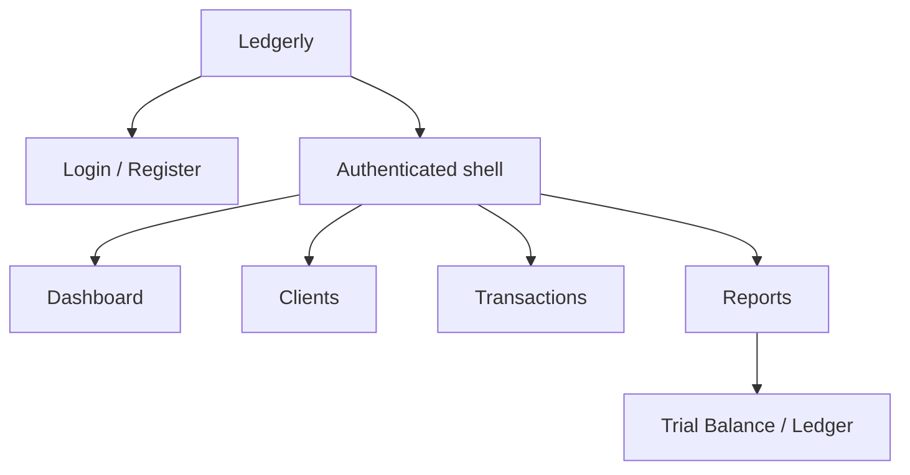
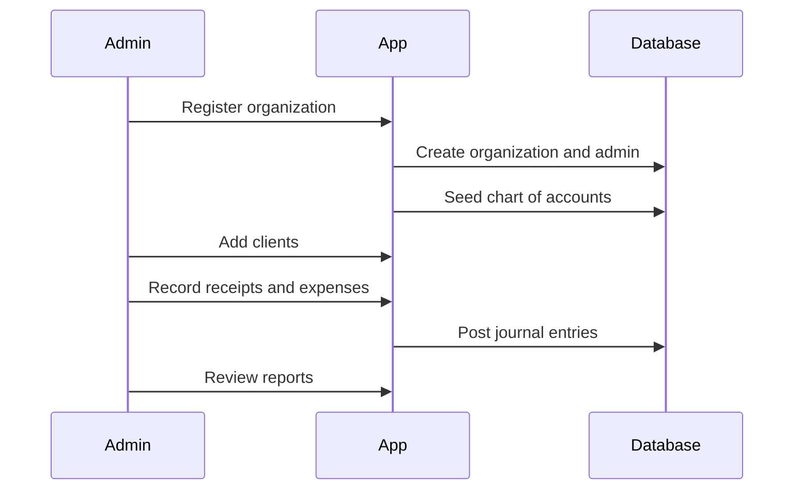
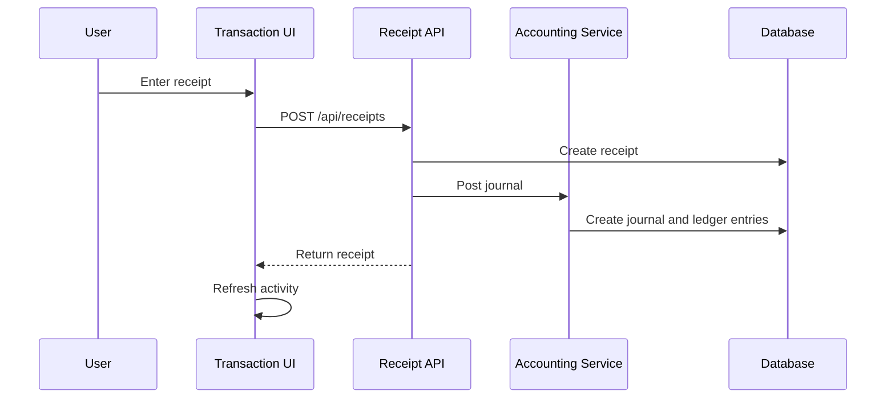

# Design Document

## 1. Product Vision

Ledgerly is designed as a premium accounting workspace for service businesses that need practical financial visibility without the weight of enterprise ERP software. The product should feel closer to QuickBooks, Zoho Books, Xero, and FreshBooks than a generic admin dashboard.

The core design goal is clarity under financial pressure: users should quickly understand cash position, client balances, expenses, and report readiness.

## 2. Target Users

| User | Primary Needs |
| --- | --- |
| Freelancer | Track client payments, expenses, profitability, and tax-ready exports |
| Consultant | Monitor retainers, receivables, cash flow, and client statements |
| Agency owner | Understand client-wise revenue, recurring costs, and monthly trends |
| Accountant | Maintain ledger correctness, audit history, and financial reports |
| Viewer | Read financial performance without changing records |

## 3. Design Principles

### Calm financial density

Financial software should prioritize scanning and comparison. The UI uses restrained cards, tables, concise labels, and charts with practical business meaning.

### Accounting confidence

Important money workflows should communicate that records are validated, auditable, and ledger-backed.

### Few decorative distractions

The interface avoids ornamental hero sections and heavy gradients. Business tools should feel stable, not performative.

### Fast task completion

Common actions are placed near the data they affect:

- Add clients on the client page.
- Record receipts and expenses on the transaction page.
- Export or email reports from report sections.

### Responsive by default

Screens should work on desktop and mobile. Tables should remain scrollable where dense financial information cannot reasonably collapse.

## 4. Information Architecture

Primary navigation:

- Dashboard
- Clients
- Transactions
- Reports
- Ledger
- Analytics

The sidebar provides persistent navigation on desktop. The topbar provides search affordance, theme controls, and user identity.

## 5. Current Screen Designs

### Authentication

Screens:

- `/login`
- `/register`

Design intent:

- Minimal centered card.
- Clear product name.
- Focus on credential entry.
- No marketing-heavy landing flow.

Current components:

- `modules/auth/auth-form.tsx`
- `app/(auth)/login/page.tsx`
- `app/(auth)/register/page.tsx`

### Dashboard

Screen:

- `/dashboard`

Primary jobs:

- Show total income.
- Show total expenses.
- Show net profit.
- Show receivables and payables.
- Show monthly cash flow.
- Show currency split.
- Surface recent transactions.
- Surface AI-style financial insights.

Visual structure:

- Page title and subtitle.
- Metric card row.
- Two-chart grid.
- Insights and recent transactions below.

Charts:

- Line chart for income, expenses, and cash flow.
- Bar chart for USD/INR currency split.

### Clients

Screen:

- `/clients`

Primary jobs:

- Create clients.
- View client directory.
- Support party master data.

Form fields:

- Client name.
- Company name.
- Email.
- Phone.
- Country.
- Currency preference.
- Tax number.
- Opening balance.
- Billing address.
- Notes.

Design intent:

- Put create form and table on the same screen for small-business speed.
- Keep table columns business-relevant.
- Use opening balance and currency as financial context.

### Transactions

Screen:

- `/transactions`

Primary jobs:

- Record incoming receipts.
- Record outgoing expenses.
- Show recent transaction activity.

Design intent:

- Receipts and expenses sit side-by-side on wide screens.
- Each form captures accounting-relevant data.
- Recent activity shows positive and negative financial motion with color cues.

### Reports

Screen:

- `/reports`

Primary jobs:

- Present P&L.
- Present Balance Sheet.
- Present Trial Balance.
- Present Expense Summary.
- Export reports.
- Email reports.

Design intent:

- Reports are sectioned as operational cards.
- Export actions are colocated with report headings.
- Trial balance remains tabular and accountant-readable.

## 6. Component System

Current shared UI primitives:

- `Button`
- `Input`
- `Card`
- `CardHeader`
- `CardContent`

Layout components:

- `Sidebar`
- `Topbar`

Design constraints:

- Cards use modest radius and borders.
- Buttons use the primary brand color.
- Inputs use clear focus rings.
- Tables favor readable row spacing and simple borders.

Recommended next components:

- `Dialog`
- `DropdownMenu`
- `Tabs`
- `Badge`
- `DataTable`
- `DateRangePicker`
- `Pagination`
- `Toast`
- `FileUpload`
- `ThemeProvider`

## 7. Visual Language

### Color

Current palette:

- Background: very light cool gray.
- Foreground: dark neutral.
- Primary: teal.
- Destructive: red.
- Muted surfaces: cool gray.

Semantic use:

- Teal: positive money movement, primary actions.
- Red: expenses, destructive actions, failures.
- Blue: cash-flow trend line.
- Neutral gray: secondary metadata and page surfaces.

### Typography

The app uses system fonts through the default Next/Tailwind setup. Typography should stay compact and work-focused:

- Page titles: medium-large, semibold.
- Section headings: compact, semibold.
- Body and table text: small to medium.
- Labels and metadata: small muted text.

### Spacing

Spacing should support repeated operational use:

- Page padding: `p-4` on small screens, `p-6` on larger screens.
- Card padding: `p-5`.
- Form grid gap: `gap-3`.
- Dashboard grid gap: `gap-4`.

## 8. Interaction Design

### Forms

Forms should:

- Validate on submit.
- Show concise error messages.
- Use native input types for date, email, number, and password.
- Reset or refresh after successful mutation.
- Preserve responsive two-column layouts where available.

### Reports

Report actions:

- PDF download.
- Excel download.
- Email prompt.

Future improvement:

- Replace browser prompt with a modal form.
- Add report date ranges.
- Add report preview before sending.

### Search

The topbar includes a global search affordance. Current API support exists for scoped client search. Future design should connect global search to:

- Clients.
- Invoices.
- Receipts.
- Expenses.
- Vendors.
- Report records.

## 9. Responsive Behavior

Current behavior:

- Sidebar is hidden on small screens.
- Main content fills available width.
- Dashboard metric cards wrap.
- Chart grid collapses from two columns to one.
- Transaction forms collapse from two columns to one.
- Tables scroll horizontally when needed.

Recommended next step:

- Add a mobile navigation drawer.
- Add compact action menus for table rows.
- Add sticky section headers for long financial tables.

## 10. Accessibility

Current accessibility basics:

- Semantic headings.
- Native form controls.
- Button labels.
- Link navigation.
- Color is not the only carrier for major values because labels accompany figures.

Recommended improvements:

- Explicit labels for every input.
- `aria-live` regions for form errors and success states.
- Keyboard-accessible dialogs and menus.
- High-contrast verification for both themes.
- Focus management after form submissions.

## 11. Empty, Loading, and Error States

Current implementation has basic form error messages and normal empty rendering. Production design should add:

- Empty client directory state with clear add-client action.
- Empty transaction activity state.
- Empty report state before ledger data exists.
- Loading skeletons for dashboard cards and charts.
- Toast feedback for successful mutations.
- Inline remediation for SMTP/export/upload failures.

## 12. Product Workflows

### New Business Setup

### Record Receipt

## 13. Future Design Enhancements

High-value design improvements:

- Full shadcn/ui component adoption.
- Editable data tables with filters, saved views, and column controls.
- Client detail page with statement, receipts, notes, and audit history.
- Invoice lifecycle pages.
- Receipt OCR review screen.
- Bank reconciliation workspace with match confidence.
- Budget planning and variance dashboards.
- Scheduled report management.
- Notification center.
- User and role management screens.

## 14. Design Acceptance Criteria

Before a screen is considered production-ready:

- Primary workflow is visible without explanatory marketing copy.
- Data hierarchy is clear within five seconds.
- Forms have validation and useful error states.
- Mobile layout does not overlap or truncate critical text.
- Tables remain readable with realistic financial values.
- Actions are colocated with the data they affect.
- Dark and light themes maintain contrast.
- Every mutation has success or failure feedback.

